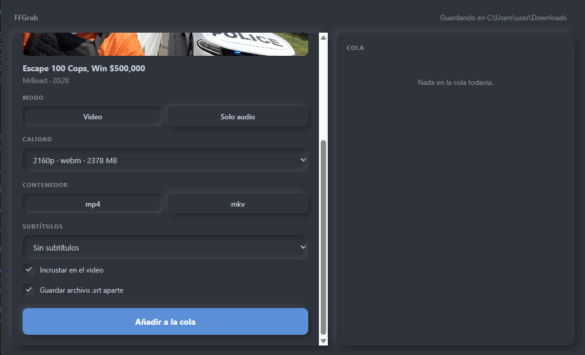
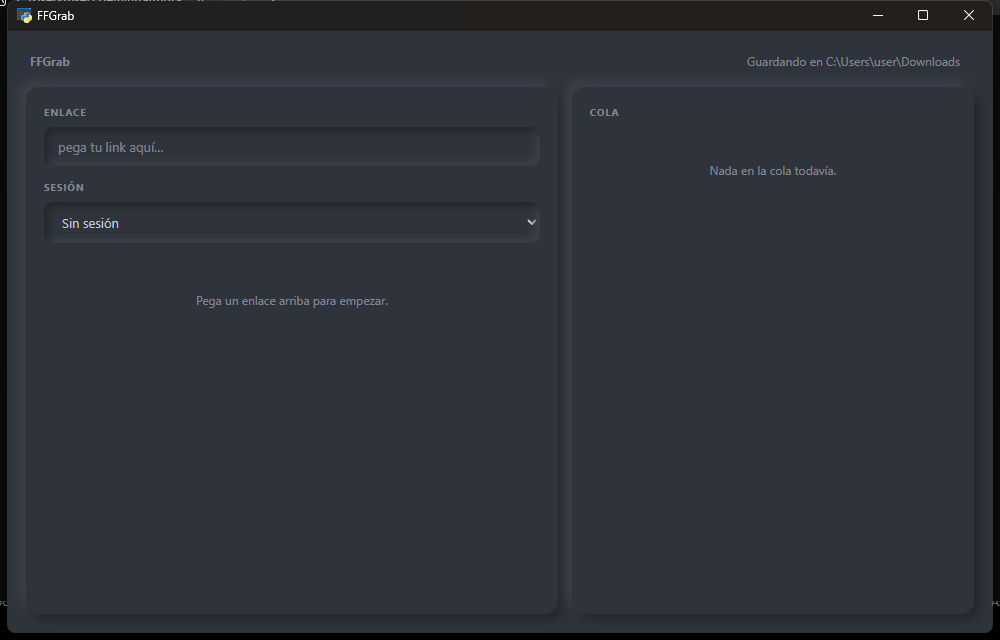

<div align="center">

# FFGrab

**Descargador de video de escritorio para Windows.**
Pegas un enlace, eliges calidad, formato, subtítulos e idioma, y lo encolas.


<br>



</div>

FFGrab es una ventana encima de [yt-dlp](https://github.com/yt-dlp/yt-dlp) y [FFmpeg](https://ffmpeg.org/), las dos herramientas que de verdad hacen el trabajo. Está para quien no quiere memorizar banderas de línea de comandos ni adivinar qué formato le va a servir: te muestra lo que hay disponible en un enlace y tú eliges, sin que la app decida por su cuenta a tus espaldas.

## Qué hace

- **Calidad** — una opción por resolución, quedándose con el códec más compatible de cada una. Un archivo que se reproduce en cualquier reproductor vale más que uno pequeño que no.
- **Formato** — MP4 o MKV. Si eliges MP4 con subtítulos incrustados te avisa de que algunos reproductores los ignoran, y te ofrece MKV. No te cambia el contenedor por su cuenta.
- **Subtítulos** — por idioma, incrustados como pista y/o guardados en un `.srt` aparte, cada cosa con su interruptor. Los autogenerados por reconocimiento de voz aparecen siempre etiquetados como tales, nunca mezclados en silencio con los escritos por personas.
- **Solo audio** — mp3 o m4a.
- **Cola** — una descarga a la vez, con progreso y cancelación por ítem. Varias en paralelo sobre la misma conexión no terminan antes: solo arrastran todas las barras a la vez.
- **ffmpeg sin instalarlo a mano** — si no lo encuentra, la app no se muestra: en su lugar aparece un botón que lo descarga. Es deliberado, y está explicado en [Problemas comunes](#problemas-comunes).

## Instalación

Necesitas Python 3.11 o superior.

```bash
git clone https://github.com/ginoarez/ffgrab
cd ffgrab
python run.py
```

En Windows también funciona con doble clic en **`run.py`**. La primera vez crea un entorno local en `.venv`, instala las dependencias y abre la app; las siguientes va directo.

> **Por qué `run.py` y no `python app.py`.** En Windows suelen convivir varios Python: el de la Microsoft Store, el de python.org, entornos virtuales. Si `python` resuelve a uno que no tiene las dependencias, la ventana abre igual pero consultar un enlace se queda colgado para siempre, sin decir por qué. El lanzador fija el intérprete y evita ese fallo, difícil de diagnosticar precisamente porque la app *parece* arrancar bien. Si el Python que lo abre es demasiado viejo, busca uno mejor en el sistema en vez de rendirse.

### Un ejecutable, si lo prefieres

```bash
pip install pyinstaller
pyinstaller ffgrab.spec
```

Deja `dist/FFGrab.exe`: un solo archivo, sin consola y sin dependencias que instalar. ffmpeg se descarga junto al ejecutable la primera vez.

**Aquí no hay ningún `.exe` publicado, a propósito.** Un binario suelto bajado de internet es justo lo que no conviene ejecutar a ciegas, y con el código a la vista puedes construir el tuyo y saber qué contiene.

## Cómo se usa



1. **Pega el enlace.** FFGrab lo consulta y te muestra título, miniatura, duración y todo lo que hay disponible.
2. **Elige.** Video o solo audio · resolución · MP4 o MKV · subtítulos por idioma, incrustados y/o en `.srt` aparte.
3. **Añadir a la cola.** Se descarga una a la vez, con progreso y un botón para cancelar. Los archivos van a tu carpeta de descargas, o a la que elijas arriba a la derecha.

## Problemas comunes

<details>
<summary><strong>El sitio pide iniciar sesión (<em>"Sign in to confirm you're not a bot"</em>)</strong></summary>

<br>

Muchos sitios responden a una consulta anónima con una verificación anti-bot. El desplegable **Sesión** le dice a FFGrab de qué navegador leer tus cookies para saltarla; cambiarlo reconsulta el enlace automáticamente.

Tres cosas que conviene saber, porque son fáciles de encontrarse:

- **Firefox** suele funcionar sin problemas, pero solo sirve si tienes la sesión iniciada **en ese** navegador.
- **Chrome y Edge** bloquean su base de datos de cookies mientras están abiertos, y las versiones recientes la cifran de forma que impide leerla. Ciérralos del todo antes de intentarlo.
- Si nada de lo anterior funciona, exporta un `cookies.txt` con una extensión de navegador y elige **"Archivo cookies.txt…"** en el desplegable Sesión para señalarlo.

</details>

<details>
<summary><strong>Todo falla con <code>CERTIFICATE_VERIFY_FAILED</code></strong></summary>

<br>

Python solo confía en su propio paquete de certificados públicos. Cuando un antivirus o un proxy corporativo inspecciona el tráfico HTTPS, instala su certificado raíz en el almacén de Windows — que el navegador sí usa y Python no. El resultado es que el navegador funciona pero yt-dlp no alcanza ningún sitio.

FFGrab lo resuelve validando contra el almacén del sistema. Si aun así te aparece, comprueba que `truststore` se instaló con las dependencias.

</details>

<details>
<summary><strong>La app no abre y solo aparece un botón para descargar ffmpeg</strong></summary>

<br>

No hace falta instalarlo a mano. FFGrab lo busca primero en su propia carpeta y después en el PATH del sistema; si no lo encuentra, la interfaz **no se muestra** y en su lugar aparece ese botón.

Es deliberado: una interfaz que funciona hasta el final y revienta justo al unir el video es el peor resultado posible. Y si encuentra un ffmpeg que existe pero no responde, lo reporta como dañado en vez de darlo por bueno.

</details>

<details>
<summary><strong>Hay una versión nueva de yt-dlp y no hay botón para actualizar</strong></summary>

<br>

Es a propósito. El aviso te dice que hay una versión nueva; actualizarla es correr `pip install -U yt-dlp` a mano.

Correr `pip install` contra el propio intérprete en caliente, en medio de una sesión que puede tener una descarga corriendo, es frágil, y un paquete a medio actualizar bajo un proceso que sigue vivo es un mal modo de fallar. Mejor decir la verdad en el aviso que fingir que hay un botón.

</details>

## Desarrollo

```bash
pip install pytest
pytest          # 104 tests
```

El reparto es sencillo: `core/` habla con yt-dlp y ffmpeg y **no sabe nada de la interfaz**; `app.py` expone esa lógica al JavaScript y no contiene ninguna; `web/` es la ventana. Esa frontera es la razón de que la lógica se pueda probar sin abrir nada.

## Créditos

El trabajo pesado no lo hace FFGrab:

- **[yt-dlp](https://github.com/yt-dlp/yt-dlp)** habla con los sitios, enumera lo disponible y descarga.
- **[FFmpeg](https://ffmpeg.org/)** une las pistas de video y audio, incrusta subtítulos y convierte formatos.

> FFGrab es un proyecto independiente y **no está afiliado ni respaldado** por los proyectos yt-dlp o FFmpeg. El nombre empieza por `ff` como guiño, no como señal de pertenencia.

## Trabajo futuro

Playlists y canales completos · subtítulos incrustados sobre la imagen (burn-in) · descargas paralelas configurables · recordar preferencias entre sesiones.

## Uso responsable

Esta herramienta es para contenido que tienes derecho a descargar. Respetar los términos de servicio de cada sitio y los derechos de autor del material queda de tu lado.

## Licencia

MIT — ver [LICENSE](LICENSE).
